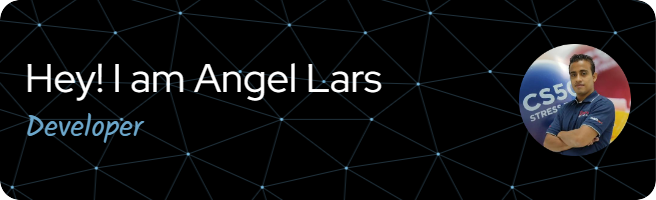

  

# Bienvenido a mi Repositorio

¡Hola! Soy Lars, ingeniero en sistemas y apasionado por la programación. Este repositorio es el espacio donde comparto mis proyectos, códigos y experiencias. Actualmente, me dedico a enseñar introducción a la programación y aquí encontrarás recursos útiles y ejemplos interesantes.

## Acerca de mí

- 👨‍💻 Ingeniero en Sistemas
- 📚 Instructor de programación
- 🏓 Amante del tenis de mesa
- 🎯 Buscando crecer y mejorar cada día

¡Explora, aprende y únete a este viaje de desarrollo! Si tienes preguntas o sugerencias, ¡estaré encantado de escucharlas!

   

## My Skill Set  
<table><tr><td valign="top" width="33%">

### Frontend  

  
  
  
  
  
  

  
  

</td><td valign="top" width="33%">

### Backend  

  
  
  
  
  
  
  
  

</td><td valign="top" width="33%">

### DevOps  

  
  
  

</td></tr></table>  

   

## Connect with me  

  

  
  

   

## Github Stats  

 

 

<table>
  <tr>
    <td valign="">
      
    </td>
    <td valign="">
      
    </td>
  </tr>
</table>

## Recent Blog Posts  
  

   

  

   
 
  

